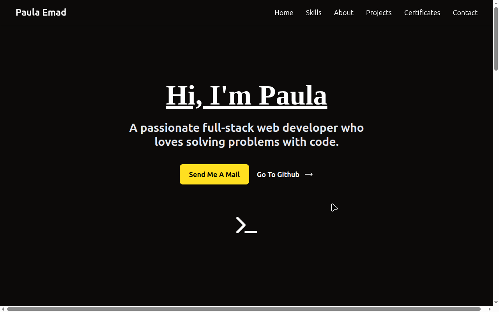

# 🌐 My Static Website

This is a simple and responsive static website built using **React** and **Tailwind CSS**. It showcases [brief description: e.g., a personal portfolio / a landing page / a bookstore frontend].

---

## ✨ Features

- ⚛️ Built with React (Vite/CRA)
- 🎨 Styled using Tailwind CSS
- 📱 Fully responsive design
- 🔒 No backend, purely static

---

## 📸 Preview

---

## 🚀 Getting Started

### 1. Clone the Repository
git clone https://github.com/your-username/your-repo-name.git
cd your-repo-name
